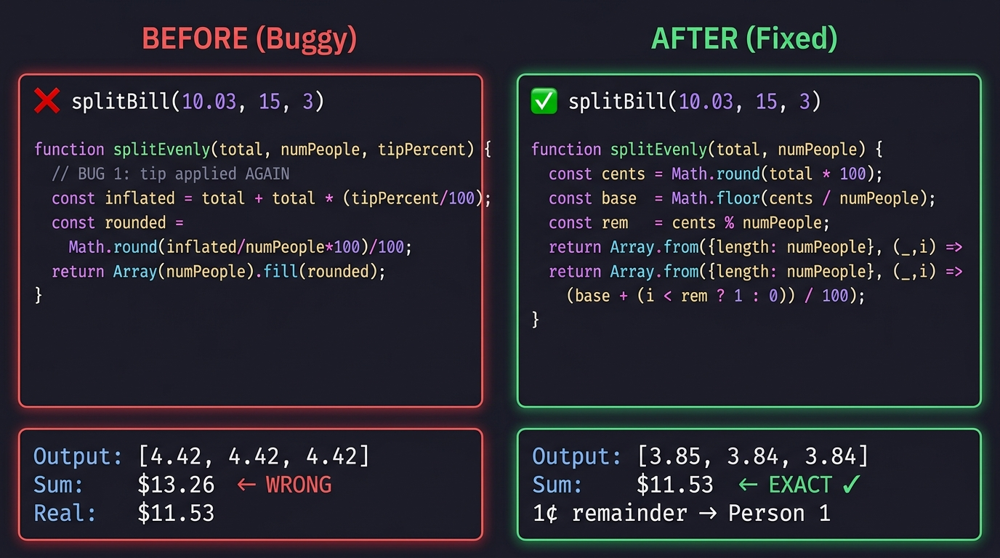

# Tip Splitter — Bug Fix

> **Task:** Fix incorrect per-person rounding in a bill-splitter utility.
> The app splits a total (bill + tip) evenly across N people, handles cents fairly,
> and shows remainder assignment explicitly.

---

## Root Cause Explanation

Two independent bugs existed in `splitEvenly`:

### Bug 1 — Double-counted tip
`calculateTotal(bill, tipPercent)` already returned `bill + tip`.
`splitEvenly` then received that total **and** `tipPercent` and re-applied the tip a second time:

```js
// Inside splitEvenly — WRONG
const totalWithExtraTip = total + total * (tipPercent / 100); // tip applied AGAIN
```

For `splitBill(10.03, 15, 3)` this inflated the working total from `$11.53` to `$13.27`
before division even started.

### Bug 2 — Remainder cents silently dropped
After dividing, every person received the **same independently-rounded value**:

```js
const rounded = Math.round(perPersonRaw * 100) / 100;
return Array(numPeople).fill(rounded); // identical copies — remainder lost
```

`$11.53 / 3 = $3.8433` rounds to `$3.84` x 3 = `$11.52` — **one cent short** of the real total.
The leftover cent simply disappeared with no assignment or error.

---

## Before / After Screenshot



---

## Fix — Diff / Patch

```diff
- function splitEvenly(total, numPeople, tipPercent) {
-   // BUG: tip is re-applied even though `total` already includes it
-   const totalWithExtraTip = total + total * (tipPercent / 100);
-   const perPersonRaw = totalWithExtraTip / numPeople;
-   const rounded = Math.round(perPersonRaw * 100) / 100;
-   return Array(numPeople).fill(rounded); // remainder silently dropped
- }
-
- function splitBill(bill, tipPercent, numPeople) {
-   const total = calculateTotal(bill, tipPercent);
-   return splitEvenly(total, numPeople, tipPercent);
- }

+ function splitEvenly(total, numPeople) {              // tipPercent param REMOVED
+   // Work in integer cents — eliminates all IEEE-754 floating-point drift
+   const totalCents = Math.round(total * 100);
+   const baseShare  = Math.floor(totalCents / numPeople);
+   const remainder  = totalCents % numPeople;
+
+   // Distribute 1 extra cent to the first `remainder` people
+   const shares = Array.from({ length: numPeople }, (_, i) =>
+     (baseShare + (i < remainder ? 1 : 0)) / 100
+   );
+
+   return {
+     shares,
+     remainderCents: remainder,
+     remainderAssignedTo: Array.from({ length: remainder }, (_, i) => i + 1),
+   };
+ }
+
+ function splitBill(bill, tipPercent, numPeople) {
+   const total = calculateTotal(bill, tipPercent); // tip applied EXACTLY ONCE, here
+   return splitEvenly(total, numPeople);           // tipPercent NOT passed down
+ }
```

---

## One-Line Commit Message

```
fix: apply tip once and distribute remainder cents explicitly instead of double-charging tip and dropping the leftover cent
```

---

## Worked Example — splitBill(10.03, 15, 3)

| Step | Buggy | Fixed |
|------|-------|-------|
| calculateTotal(10.03, 15) | $11.53 | $11.53 |
| Working total inside splitEvenly | $11.53 x 1.15 = $13.27 (BUG) | $11.53 (correct) |
| Total in cents | 1327c (wrong) | 1153c (correct) |
| Base share per person | 442c | 384c |
| Remainder | ignored | 1c assigned to Person 1 |
| Shares | [$4.42, $4.42, $4.42] (WRONG) | [$3.85, $3.84, $3.84] (CORRECT) |
| Sum | $13.26 (WRONG) | $11.53 (EXACT) |
| Matches grand total? | No | Yes |

---

## Key Invariants Guaranteed by the Fix

- Tip is applied exactly once — inside calculateTotal only
- All arithmetic is done in integer cents — no floating-point rounding drift
- Shares differ by at most 1 cent — no person is over-charged by more than a single cent
- sum(shares) === grandTotal — mathematically guaranteed for every valid input
- Remainder cents are explicitly named (remainderAssignedTo) — never hidden

---

## Files

| File | Purpose |
|------|---------|
| tip-splitter-fixed.js | Corrected implementation with verification |
| tip-splitter-buggy.js | Original buggy code preserved for reference |
| index.html + app.js + style.css | Full browser UI with audit log |
